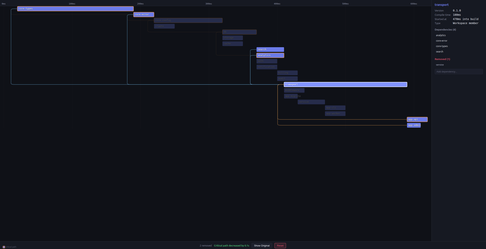

# cargo-goodtimes

Interactive compilation timing analyzer for Rust projects — visualizes the critical path of crate compilation as a Gantt chart.



## Features

- **Gantt chart** of every crate's compilation timeline
- **Critical path** highlighting — see which dependency chain determines your total build time
- **What-if analysis** — modify dependency edges in the browser to explore hypothetical build graphs

## Installation

```bash
cargo install cargo-goodtimes
```

Prebuilt frontend assets are included in the crate — no Bun or Node.js required.

> **Note:** Modifying the frontend requires [Bun](https://bun.sh).

## Usage

```bash
# Analyze the project in the current directory
cargo goodtimes

# Analyze a specific project
cargo goodtimes --manifest-path /path/to/project

# Use release profile
cargo goodtimes --profile release

# Enable specific features
cargo goodtimes --features feat1,feat2

# Enable all features
cargo goodtimes --all-features

# Include third-party dependencies in the chart
cargo goodtimes --include-deps

# Don't open the browser automatically
cargo goodtimes --no-open
```

The tool will:
1. Clean workspace crates (external deps stay cached)
2. Run `cargo check --timings`
3. Parse the timing data and compute the critical path
4. Generate a self-contained HTML report and open it in your browser

## Future improvements

- **Machine-readable timings:** Timing data is extracted by parsing the undocumented `UNIT_DATA` embedded in cargo's `--timings` HTML output, which may change between Rust versions. Cargo's `--timings=json` is currently nightly-only — once stabilized, this tool can switch to it for a more reliable data source.